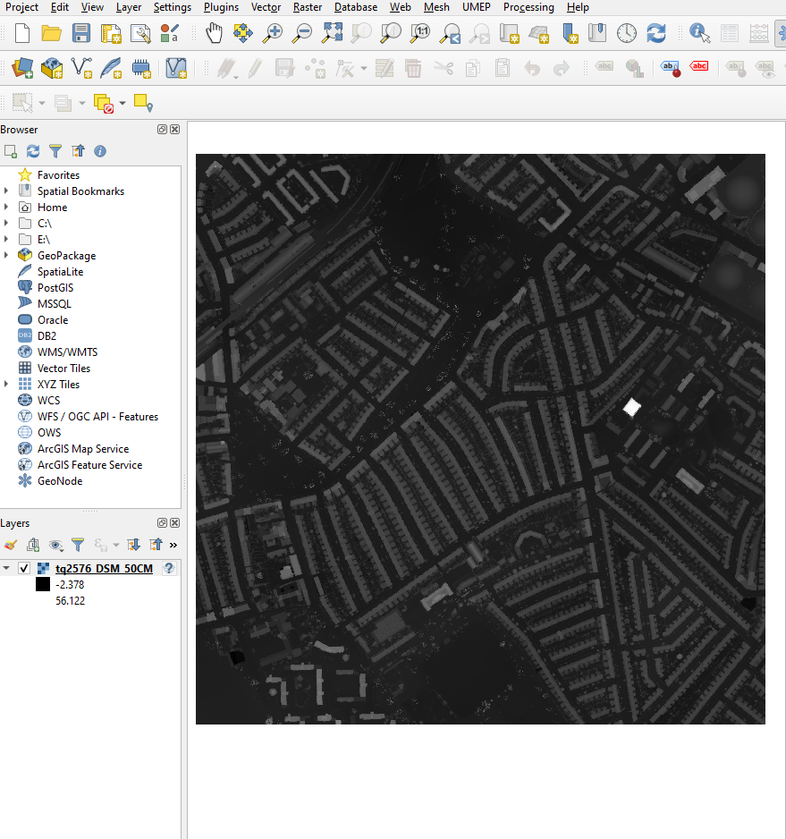
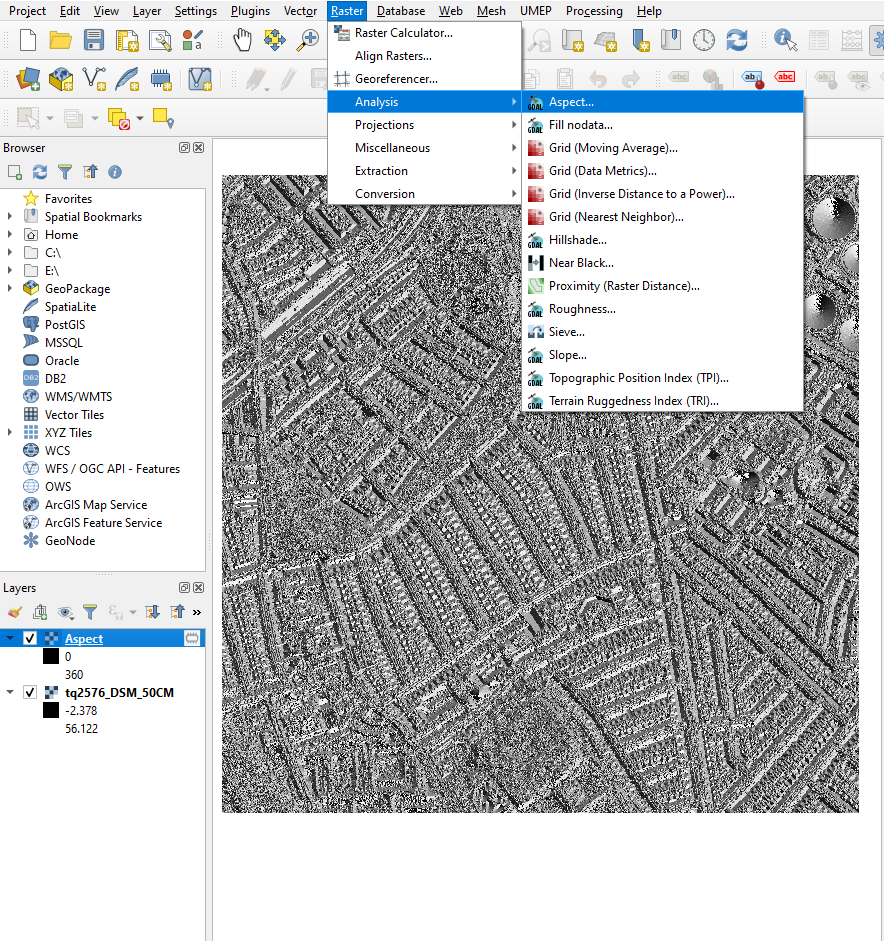
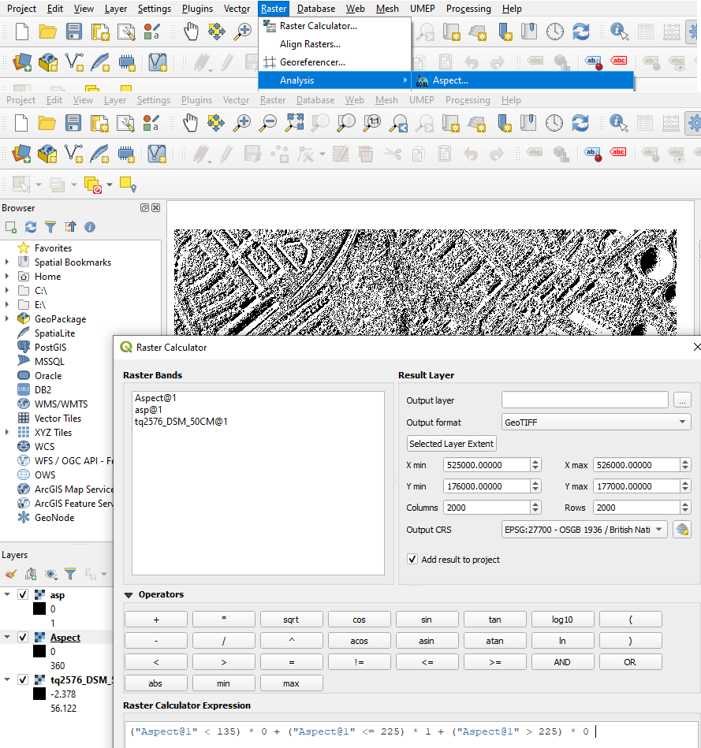
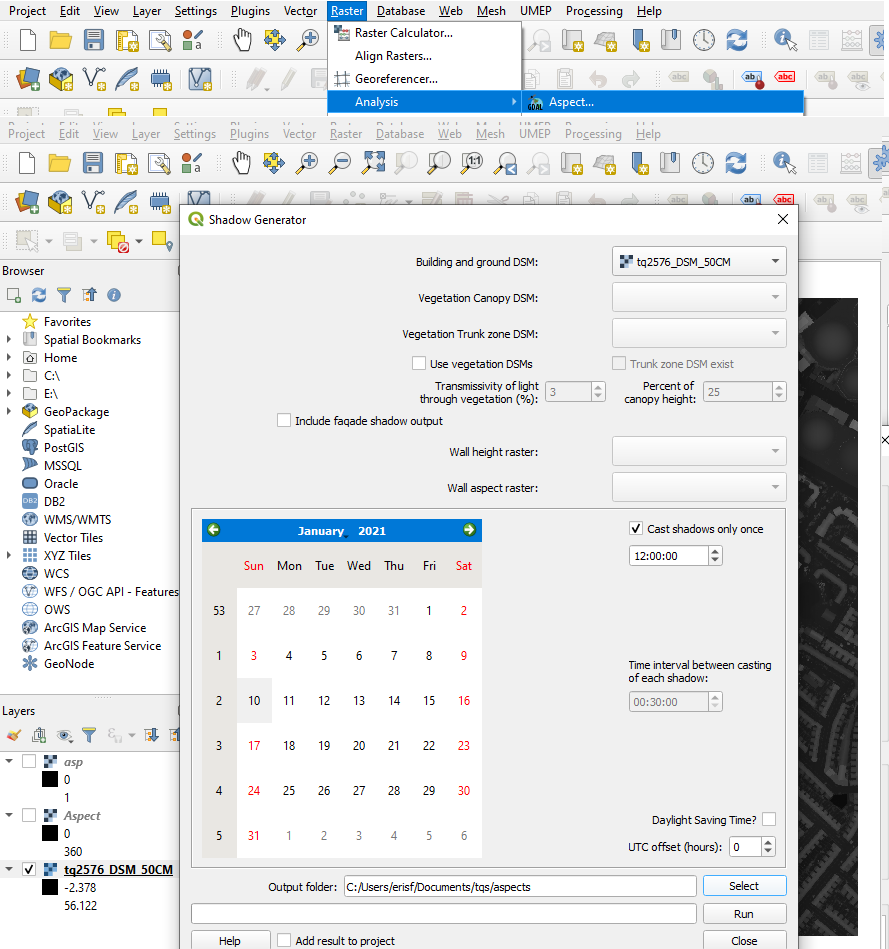
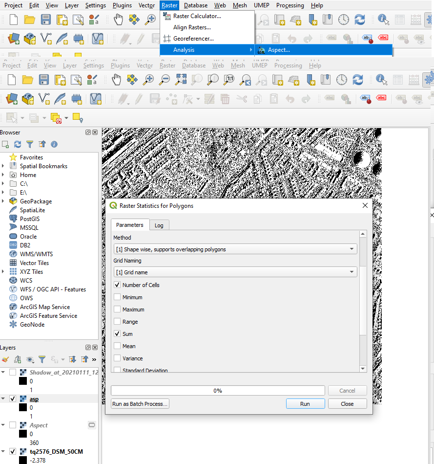
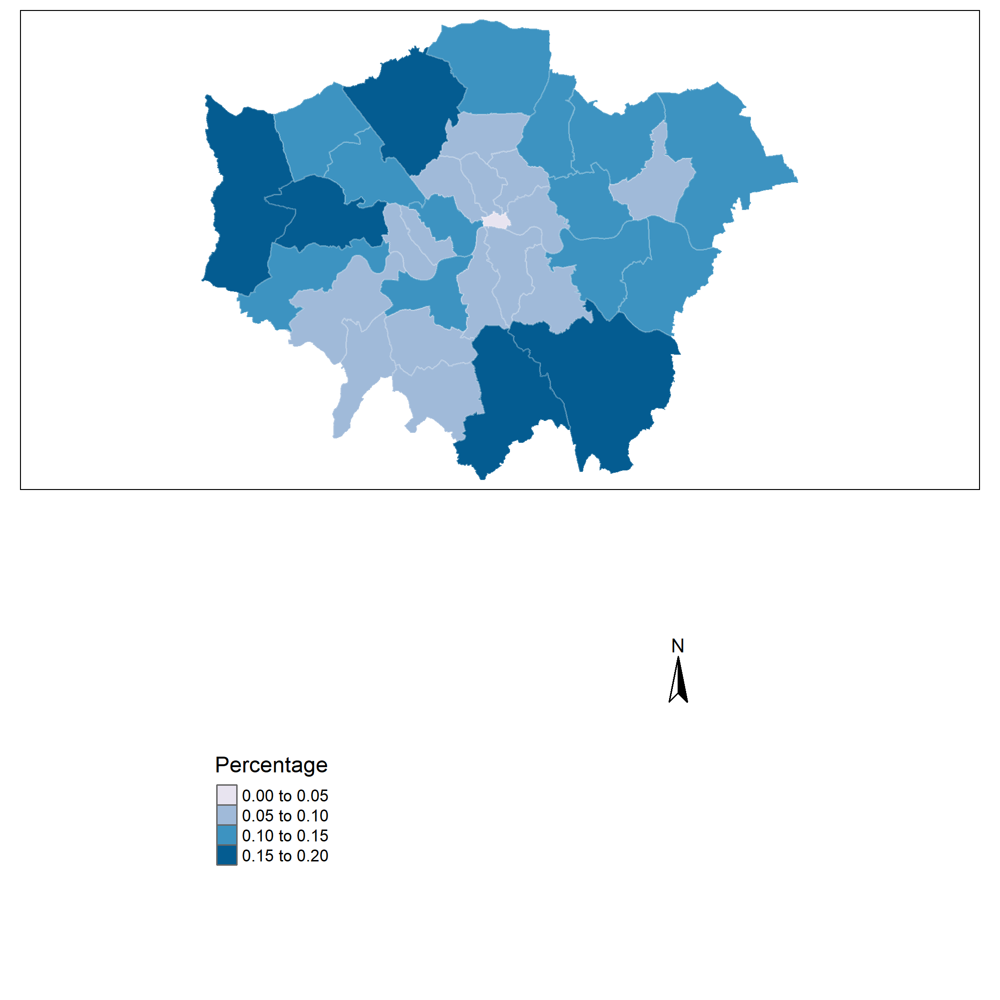
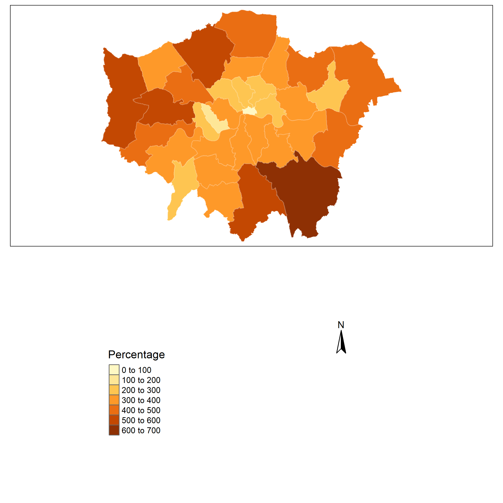
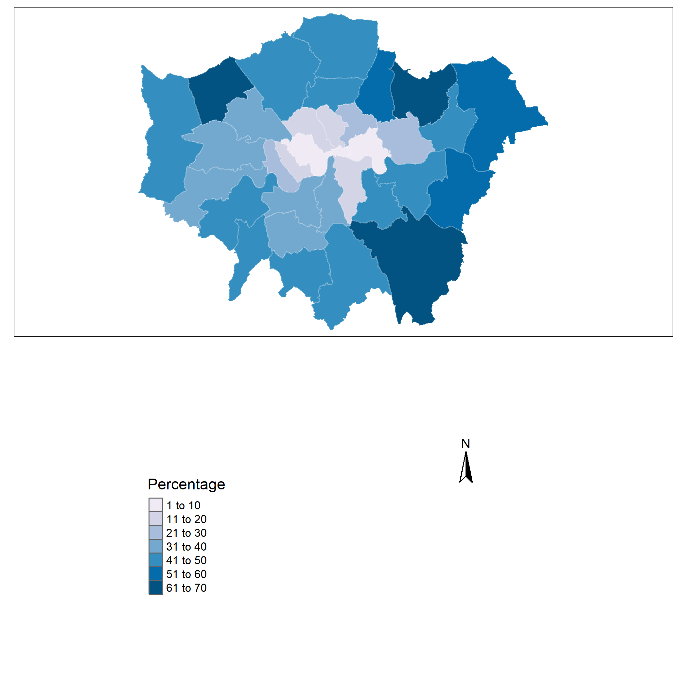

```{r setup, include=FALSE}
knitr::opts_chunk$set(echo = TRUE)
```

## Estimation of London’s Rooftop Solar Energy Potential

In this tutorial, technical solar rooftop PV panels will be estimated. Study area is London, UK. The analysis has two main stages: 

 * QGIS program will be used to characterize which parts of rooftop area is suitable for PV installation.
  
 * R studio will be used to calculate energy output of suitable PV area installed PV panel
 
To conduct analysis: 

 * LIDAR data [^1] <https://environment.data.gov.uk/DefraDataDownload/?Mode=survey>
 * Landcover data <https://www.ordnancesurvey.co.uk/business-government/products/open-map-local>
 * London Wards data <https://data.london.gov.uk/dataset/statistical-gis-boundary-files-london>
 * Energy Consumption data <https://data.london.gov.uk/dataset/electricity-consumption-borough>
 
 [^1]: LIDAR Data divided into cells for London that contains almost 120 file. In the following part of analysis, processed data will be shared. 
 
 
## QGIS Part 


> Aspect Analysis.

At first, let's add raster LIDAR layer in order to do aspect and shadow analysis.

Layer -> Add Layer -> Add Raster Layer.



> Process lidar asc into aspect raster 

By using QGIS Toolbox: GDAL -> Aspect 



> Reclassify aspect layer to simplify values by Raster Calculator.

("Aspect@1" < 135) * 0 + ("Aspect@1" <= 225) * 1 + ("Aspect@1" > 225) * 0  

This process will also help us to reduce large file size. 




As a result, we have binary raster which norther facing parts have 0 value and others have 1 value.

> Shadow Analysis 

To conduct shadow analysis, UMEP plugin is required. 

-> UMEP -> Processor -> Solar Radiation -> Daily Shadow Patter -> Adding LIDAR data


> Comparing shadow layer and aspect layer

With raster calculator suitable area for rooftop will have 1 value. 

"asp@1" * "Shadow_at_20210111_1200@1" * "0.25"

Because each cell is 50 cm X 50cm, we multiply it by 0.25 cm^2. For the further process, it will help us to calculate area.

> Adding londonbuildings.shp vector layer 

-> Using SAGA -> Raster Statistics for polygons -> Selecting londonbuildings polygon and rasters -> Number of cells and sum to calculate suitable area on each building polygon. Then we can export results and import to R studio for calculations. 



## R Studio 


```{r cars}
# required libraries
library(raster)
library(rgdal)
library(rgeos)
library(ggplot2)
library(dplyr)
library(sf)
library(here)
library(tidyverse)
library(spatstat)
library(sp)
library(rgeos)
library(maptools)
library(GISTools)
library(tmap)
library(geojson)
library(geojsonio)
library(tmaptools)
```


Importing necessary data... 

```{r 1}
#london boroughs and wards datasets

londonwards <- st_read(here("data","raw", "London_Ward.shp"))

londonboroughs <- st_read(here("data","raw", "London_Borough_Excluding_MHW.shp"))

#reading london rooftop data processed in QGIS

rooftoplondon <- st_read(here("data","qgisprocessed", "londonpvstatistics.gpkg"))

#Replacing null values with 0 
rooftoplondon <- rooftoplondon %>%
  replace(is.na(.), 0)
```

Because the LIDAR file of London as total is very large size, approxiamately 8.5 gb. We divided London into 10 parts to calculate fast. Therefore, in the following step, sutaible PV area is calculated 


```{r 2}
#adding total potential pv area column to dataframe 

rooftoplondon$pvarea <- rooftoplondon$X1..SUM.+ rooftoplondon$X2..SUM.+rooftoplondon$X3..SUM+rooftoplondon$X4..SUM.+rooftoplondon$X5..SUM.+
  rooftoplondon$X6..SUM.+rooftoplondon$X7..SUM.+rooftoplondon$X8..SUM.+rooftoplondon$X9..SUM.+rooftoplondon$X11..SUM.

```

Next step is calculating each building footprint area.
```{r 3}
#calculating total rooftop area of each building 

rooftoplondon$area <- st_area(rooftoplondon)
#Transforming to integer 
rooftoplondon$area <- gsub("C([0-9]+)_.*", "\\1", rooftoplondon$area)%>%
  as.integer(rooftoplondon$area)
```


There are missing values in LIDAR data resulted in building rooftop area as 0
Therefore, I estimate them in a traditional way. 
Multiply rooftop which are 0 by general ratio and removing decimals because we have 1X1 


```{r 4}
#calculating total rooftop area of each building 
ratio <- sum(rooftoplondon$pvarea)/sum(rooftoplondon$area[rooftoplondon$pvarea!=0])
#General ratio is 0.70
rooftoplondon <- rooftoplondon %>%
  mutate(pvareanew = ifelse(pvarea == 0,lapply(area*ratio, as.integer),pvarea))
```

```{r 5}
#Calculating total pv area in London 
rooftoplondon$pvareanew <- unlist(rooftoplondon$pvareanew)
totalpvarea <- sum(rooftoplondon$pvareanew) # we have 175.826.108 m^2 available roofplane area
```


getting center points of each building in order to find which wards they are from

```{r 6}
centroids <- rooftoplondon %>%
  st_zm()%>%
  st_centroid()

#ward intersection for each building 
centroids <- st_set_crs(centroids, 27700)
londonwards <- st_transform(londonwards, 27700)
rooftoplondonwards <- st_intersection(centroids, londonwards)

#Removing unnecessary columns 

rooftoplondonwards <- subset(rooftoplondonwards, select = c("ID","GSS_CODE.1","NAME.1", "BOROUGH", "area", "pvareanew"))

#calculating total potential rooftop area grouping by each wards

rooftoplondonwards <- rooftoplondonwards %>% 
  group_by(GSS_CODE.1) %>%
  summarise(sumpvarea = sum(pvareanew))

#creating final dataframe 
finallondonwards <- londonwards %>% arrange(GSS_CODE)
finallondonwards$pvarea <- rooftoplondonwards$sumpvarea

```


Calculating Solar Electricty Output and CO^2 reduce output


```{r 7}
finallondonwards$kWp <- (finallondonwards$pvarea/1.7)*200/1000
finallondonwards$Ep <- finallondonwards$kWp*0.75*1108*0.70
finallondonwards$EpAsGWh <- finallondonwards$Ep/10^6

sum(finallondonwards$EpAsGWh) # sum of amount of electricty provided by solar panels = 17603.38 GWh

#calculating greenhouse emission reduced
finallondonwards$EpAsMWh <- finallondonwards$EpAsGWh*10^6
finallondonwards$MtCO2 <- finallondonwards$EpAsMWh*0.2977/10^9

sum(finallondonwards$MtCO2) #773341.4 tCo2 is reduced 


consumptiondata <- read.csv(here("data","raw", "energyconsumption.csv"))

#Turning to borough scale
finallondonboroughcalculated <- finallondonwards %>% 
  group_by(LB_GSS_CD) %>%
  summarise(sumpvarea = sum(pvarea), sumMtCO2 = sum(MtCO2), sumGWH = sum(EpAsGWh))

finallondonboroughcalculated$consumption <- consumptiondata$consumption

finallondonboroughcalculated$rate <- finallondonboroughcalculated$sumGWH/finallondonboroughcalculated$consumption

sum(finallondonboroughcalculated$consumption)
finallondonboroughcalculated$GWHasinteger <- as.integer(finallondonboroughcalculated$sumGWH)
finallondonboroughcalculated$percent <- as.integer(finallondonboroughcalculated$rate*100)

```


Plotting 


```{r 8}
tm1 <- tm_shape(finallondonboroughcalculated) +
  tm_polygons("sumGWH",
              palette="seq",
              style="jenks",
              midpoint=NA,
              border.col = "white", 
              border.alpha = 0.2,
              popup.vars=c("LB_GSS_CD", "sumGWH"),
              title="Percentage") +
  tm_legend(show=FALSE)

legend1 <- tm_shape(finallondonboroughcalculated) +
  tm_polygons("sumGWH",
              palette="seq",
              style="jenks",
              midpoint=NA,
              popup.vars=c("LB_GSS_CD", "sumGWH"),
              title="Percentage") +
  tm_layout(legend.only = TRUE, legend.position=c(0.2,0.25),asp=0.1)+
  tm_compass(north=0, position=c(0.65,0.6))

t1=tmap_arrange(tm1, legend1)
t1
tmap_save(t1, 'GWHjenks.png')

tm2 <- tm_shape(finallondonboroughcalculated) +
  tm_polygons("percent",
              palette="PuBu",
              midpoint=NA,
              border.col = "white", 
              border.alpha = 0.2,
              popup.vars=c("LB_GSS_CD", "percent"),
              title="Percentage") +
  tm_legend(show=FALSE)

legend2 <- tm_shape(finallondonboroughcalculated) +
  tm_polygons("percent",
              palette="PuBu",
              midpoint=NA,
              popup.vars=c("LB_GSS_CD", "percent"),
              title="Percentage") +
  tm_layout(legend.only = TRUE, legend.position=c(0.2,0.25),asp=0.1)+
  tm_compass(north=0, position=c(0.65,0.6))
  
t2=tmap_arrange(tm2, legend2)
t2
tmap_save(t2, 'percentage.png')

tm3 <- tm_shape(finallondonboroughcalculated) +
  tm_polygons("sumMtCO2",
              palette="BuPu",
              midpoint=NA,
              border.col = "white", 
              border.alpha = 0.2,
              popup.vars=c("LB_GSS_CD", "sumMtCO2"),
              title="Percentage") +
  tm_legend(show=FALSE)

legend3 <- tm_shape(finallondonboroughcalculated) +
  tm_polygons("sumMtCO2",
              palette="BuPu",
              midpoint=NA,
              popup.vars=c("LB_GSS_CD", "sumMtCO2"),
              title="Percentage") +
  tm_layout(legend.only = TRUE, legend.position=c(0.2,0.25),asp=0.1)+
  tm_compass(north=0, position=c(0.65,0.6))

t3=tmap_arrange(tm3, legend3)
t3
tmap_save(t3, 'CO2NEW.png')


tm4 <- tm_shape(finallondonboroughcalculated) +
  tm_polygons("sumMtCO2",
              palette="PuBu",
              midpoint=NA,
              border.col = "white", 
              border.alpha = 0.2,
              popup.vars=c("LB_GSS_CD", "sumMtCO2"),
              title="Percentage") +
  tm_legend(show=FALSE)

legend4 <- tm_shape(finallondonboroughcalculated) +
  tm_polygons("sumMtCO2",
              palette="PuBu",
              midpoint=NA,
              popup.vars=c("LB_GSS_CD", "sumMtCO2"),
              title="Percentage") +
  tm_layout(legend.only = TRUE, legend.position=c(0.2,0.25),asp=0.1)+
  tm_compass(north=0, position=c(0.65,0.6))

t4=tmap_arrange(tm4, legend4)
t4
tmap_save(t4, 'CO21.png')

tmap_mode("plot")

```







